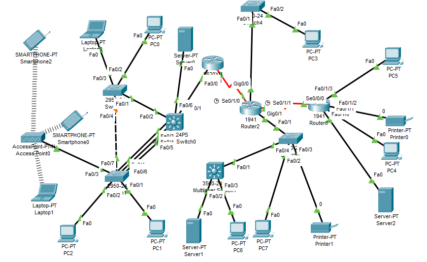

# Enterprise Multi-Site Network Architecture Simulation
## Comprehensive Cisco Packet Tracer Deployment (Core Services, Dynamic Routing & AAA Security)

## 📌 Project Overview
This repository contains a production-grade enterprise network simulation developed inside **Cisco Packet Tracer**. The project models a highly resilient, secure, and scalable multi-site enterprise infrastructure. It demonstrates the practical implementation of end-to-end network engineering paradigms—ranging from foundational Layer 2 virtualization and multi-protocol dynamic routing to distributed infrastructure services and advanced cryptographic security blueprints (AAA/RADIUS framework).

Designed as a core demonstration of enterprise networking proficiency, this project transitions theoretical network models into fully functional CLI configurations across multi-vendor topologies.

---

## 🛠️ Key Technical Frameworks & Features

### 1. Advanced Routing & Switching Architecture
* **Dynamic Multi-Protocol Core:** Engineered dynamic routing across complex topologies using **EIGRP**, **OSPF**, and **RIPv2** protocols, ensuring optimal path selection, fast convergence, and route redistribution.
* **Inter-VLAN & Subnet Segmentation:** Implemented Router-on-a-Stick and Multi-Layer Switching (MLS) architectures to achieve seamless line-rate inter-VLAN routing across diverse subnets.
* **Static Route Injection:** Configured precise static and floating backup routes for resilient upstream ISP and peer-office connectivity.

### 2. High Availability & Layer 2 Resilience
* **Rapid Spanning Tree Protocol (RSTP):** Deployed Rapid STP across the switching infrastructure to prevent bridging loops, explicitly tuning bridge priorities and establishing dedicated Root Bridges (`SW0`) to ensure predictable, sub-second failovers.
* **VLAN Trunking Protocol (VTP):** Implemented a centralized VTP Server-Client hierarchy to automate VLAN propagation across access-layer switches, maintaining database consistency.

### 3. Enterprise Security & Access Control (AAA Blueprint)
* **Centralized AAA/RADIUS Infrastructure:** Structured an industry-standard Authentication, Authorization, and Accounting (AAA) topology utilizing a centralized RADIUS server infrastructure.
* **Hardened Device Management:** * Implemented secure remote terminal control via **SSHv2** with local cryptographic key generation, completely disabling unencrypted Telnet endpoints.
  * Configured multi-tier privilege levels for restricted role-based CLI execution.
  * Enforced explicit local and database-driven console and virtual line (`VTY 0-15`) authentication parameters using shared cryptographic strings (`var8`).

### 4. Core Infrastructure & Distributed Network Services
* **Dynamic Address Allocation (DHCP):** Provisioned distributed, multi-scope DHCP pools directly on core edge routers and dedicated servers to automate IPv4 addressing across heterogeneous client segments (PCs, Laptops, Wireless End Devices).
* **Enterprise DNS & Web Frameworks:** Deployed a fully integrated internal DNS infrastructure utilizing hierarchical authoritative records (`A-Records`, `CNAME`, `SOA`, `NS`) linking corporate domains (e.g., `grow.chenk.ru`, `DNS.chenk.ru`, `yellow.chenk.ru`) to internal Web and security platforms.
* **Dual-SSID Secure Wireless Infrastructure:** Managed corporate wireless access networks using specialized Access Points segmented by administrative roles (*Workers* vs. *Management/Leadership*).

---

## 📐 Network Addressing & Device Matrix

Below is a detailed layout of the core production infrastructure implemented during the final deployment phase:

| Device Name | Interface | IPv4 Address / Subnet Mask | Associated VLAN | Role & Core Functionality |
| :--- | :--- | :--- | :--- | :--- |
| **R0 (Router0)** | F0/0   S1/0 | `76.1.2.3 /27`   `124.10.6.5 /30` | Core Upstream | Core WAN Gateway & DHCP Server |
| **R2 (Router2)** | S0/0/0   S0/0/1   G0/0   G0/1.1   G0/1.3 | `124.10.6.6 /30`   `11.5.5.1 /30`   `18.13.2.17 /28`   `14.5.2.17 /28`   `71.8.5.2 /24` | WAN Peers   Local Segments | Core Transit & Inter-VLAN Sub-interface Router |
| **R3 (Router6)** | VLAN 9   G0/1   S0/0/0 | `10.140.1.133 /26`   `71.8.5.2 /30`   `11.5.5.2 /30` | VLAN 9   Infrastructure Links | Secure Operations Gateway & Regional DHCP Server |
| **grow.chenk.ru** | FE0 | `76.1.2.5 /27` | VLAN 1 | Corporate Web Server & Centralized AAA Node |
| **DNS.chenk.ru** | FE0 | `14.5.2.18 /28` | VLAN 1 | Primary Authoritative Enterprise DNS Server |
| **yellow.chenk.ru**| FE0 | `10.140.1.134 /26` | VLAN 1 | Secondary Regional DNS Server Node |
| **SW0** | Vlan1 | `76.1.2.1 /27` | VLAN 1 | Core Multi-Layer Switch / Primary RSTP Root |
| **SW1** | Vlan1 | `76.1.2.2 /27` | VLAN 1 | Distribution Switch |
| **SW2** | Vlan1 | `76.1.2.4 /27` | VLAN 1 | Access Layer Switch |

### Network Segmentation (VLAN Allocation)
* **VLAN 1:** Management & Core Infrastructure Services
* **VLAN 3:** General Client Terminals
* **VLAN 9:** Secure Operations, Shared Printer Infrastructure, and Dedicated Servers
* **VLAN 20:** Enterprise Wireless Domain (Corporate Laptops & Smart Terminals)
* **VLAN 24:** Dedicated Engineering Host Segments

---

## 🚀 Implementation & CLI Deployment Phase Breakdown

### Phase 1: Foundational Hardening & Layer 2 Services
1. **Device Initial Setup:** Assigned hostnames according to enterprise naming conventions, set secure encrypted executive passwords, and established descriptive Message of the Day (`banner motd`) banners across all nodes.
2. **VLAN and Trunk Provisioning:** Established strict 802.1Q encapsulation trunks between switches and routers, blocking untrusted traffic.
3. **STP Root Engineering:** Standardized Layer 2 convergence by enforcing Rapid STP, setting `SW0` to the highest root priority, followed by incremental scaling on `SW1` and `SW2` to prevent active black-holes.

### Phase 2: WAN Integration & Core Dynamic Routing
1. **Dynamic EIGRP Fabric:** Deployed EIGRP dynamic routing across the corporate core. Autonomous system tracking allowed sub-second route calculations across serial and fiber uplinks.
2. **Distributed DNS Hierarchies:** Configured deep DNS pointer matrices on servers, mapping resources with authoritative start of authority (`SOA`) lines, nameserver (`NS`) declarations, and corresponding canonical entries (`CNAME`).

### Phase 3: Cryptographic Hardening (AAA Framework)
1. **Centralized RADIUS Configuration:** Linked Router R6 virtual terminal loops directly to the RADIUS backend server (`Server0`).
   * **Authentication Protocol:** Centralized RADIUS with local fallback lookup.
   * **Ports & Keys:** Configured standard ports `1812` (Authentication) and `1813` (Accounting) utilizing secure local cryptographic strings (`var8`).
2. **Granular Access Privileges:** Restricted administrative console and virtual access terminals (`VTY 0-15`) to prompt instantly for remote authentication, bypassing direct line access and mapping authenticated users directly to their designated privilege executive tiers.

---

## 🔍 Verification & Diagnostics

The operational integrity of this network architecture was validated using rigorous diagnostic matrices:
* **ICMP Domain Integrity:** End-to-end multi-subnet round-trip verification executed via CLI terminals using full domain name resolution (`ping yellow.chenk.ru`) instead of raw destination IPs, testing both routing fabric and DNS convergence.
* **Cryptographic Remote Access Validation:** Initiated remote terminal sessions (`ssh -v 2 -l admin <target_ip>`) from edge nodes, verifying encryption renegotiation and confirmation logs against the RADIUS repository database.
* **Layer 2 Topology Validation:** Verified loop-free physical mesh architectures using CLI diagnostic queries (`show spanning-tree`, `show cdp neighbors`, and `show ip route`).

---

## 📂 Repository Contents
* `📁 topology/` — Contains the complete Cisco Packet Tracer `.pkt` file with pre-saved running configurations.
* `📁 configs/` — Individual text files detailing the precise CLI running configurations for each Core Router and Switch (`R0`, `R2`, `R6`, `SW0`, etc.).
* `📄 README.md` — Comprehensive project documentation and architecture blueprint.

---

## 🎯 Professional Skills Demonstrated
* Enterprise Network Design & Hierarchy (Core, Distribution, Access Layers)
* Subnetting & Variable Length Subnet Masking (VLSM)
* Advanced CLI Configuration (Cisco IOS)
* Multi-Protocol Routing Convergence (EIGRP, OSPF, RIPv2)
* Infrastructure Security Auditing & Centralized AAA Deployment (RADIUS)
* Layer 2 Loop Prevention & Traffic Engineering (RSTP, VTP, 802.1Q Trunks)
